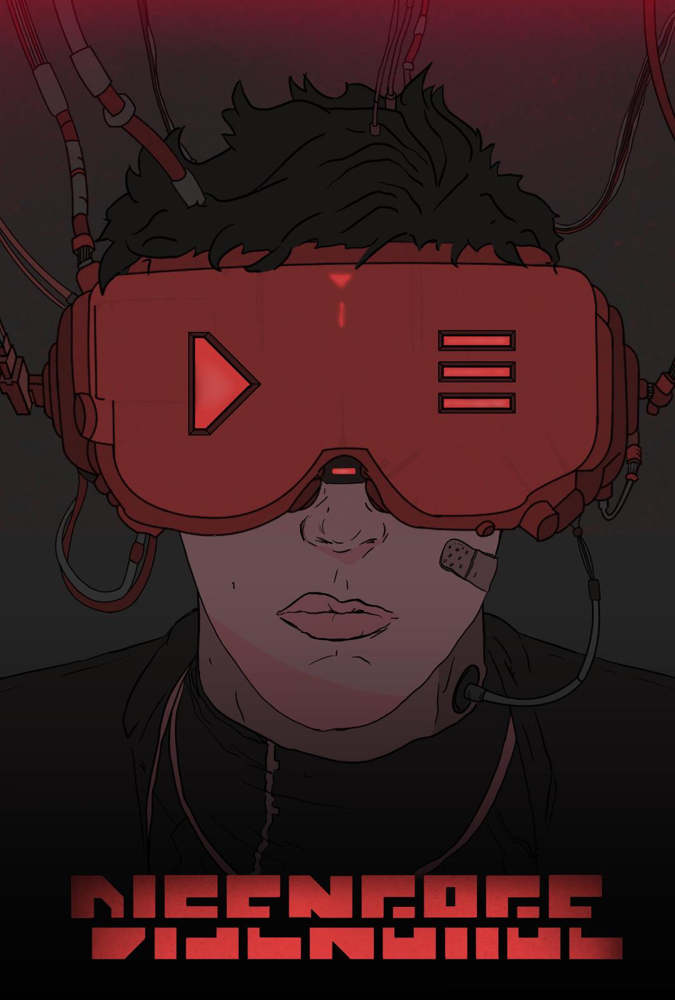

<h1 align="center">Disengage</h1>

A roguelike game where you're a programmer inside a corrupted videogame, trapped in its testing phase. It was made in 2020/2021 for the subject of Fundamentals of Videogames at the University of Alicante.

<h3 align="center">Used tools</h3>

Tiled, TinyXML, SFML and c++.

<h6 align="center"><a href="https://www.youtube.com/watch?v=68yeaUsMal0">Trailer</a></h6>

